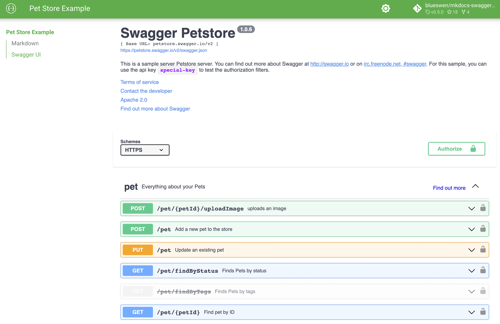

# MkDocs Swagger UI Tag 

A MkDocs plugin supports for add [Swagger UI](https://github.com/swagger-api/swagger-ui) in page.

## Features

1. Multiple OpenAPI Specification file source: url, static file in docs
2. Multiple Swagger UI in same page

## Dependency

1. Python Package
    1. beautifulsoup4==4.11.1
2. [Swagger UI dist](https://www.npmjs.com/package/swagger-ui-dist) javascript file and css file
    1. swagger-ui-dist==4.12.0

## Usage

1. Install plugin from pypi

    ```bash
    pip install mkdocs-swagger-ui-tag
    ```

2. Add ```swagger-ui-tag``` plugin in to your mkdocs.yml plugins sections:

    ```yaml
    plugins:
       - swagger-ui-tag
    ```

3. You may customize the plugin by passing options in mkdocs.yml:

    ```yaml
    plugins:
       - swagger-ui-tag:
            background: White
    ```

    | Option     | Default | Description                                                                                                                                       |
    |------------|---------|---------------------------------------------------------------------------------------------------------------------------------------------------|
    | background | White   | Swagger UI iframe body background attribute value. You can use any css value for background for example "#74b9ff" or Gainsboro or "" for nothing. |

4. Add ```swagger-ui``` tag in markdown to include Swagger UI

    ```markdown
    <swagger-ui src="https://petstore.swagger.io/v2/swagger.json"/>
    ```

    

## License

This project is licensed under the MIT License - see the [LICENSE.md](https://github.com/Blueswen/mkdocs-swagger-ui-tag/blob/main/LICENSE) file for details.
